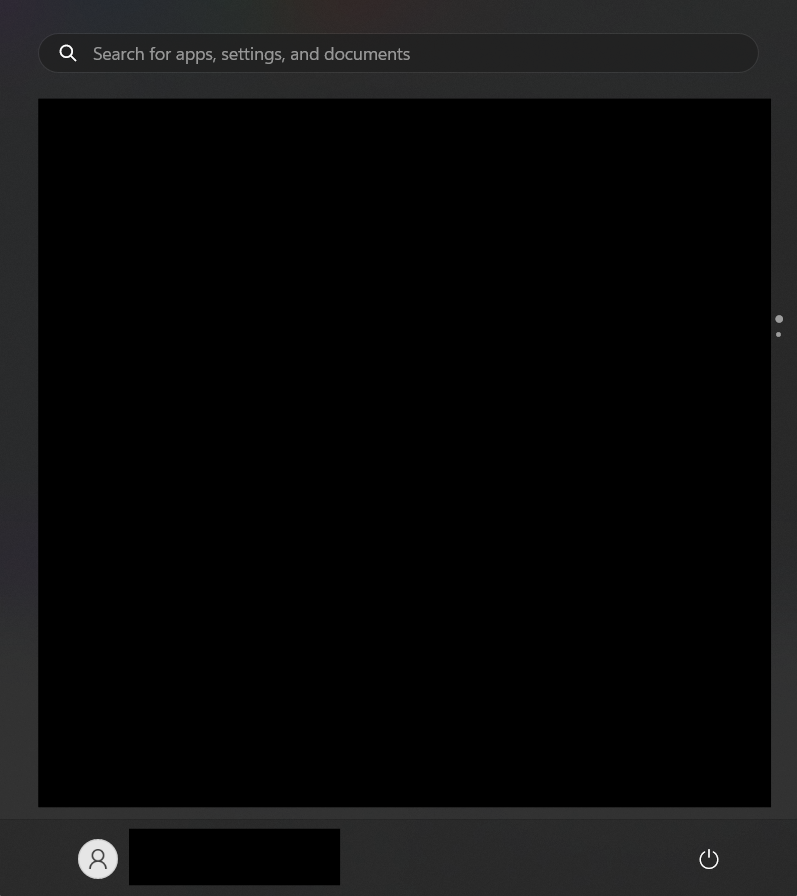
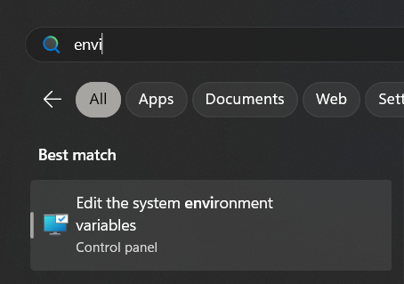
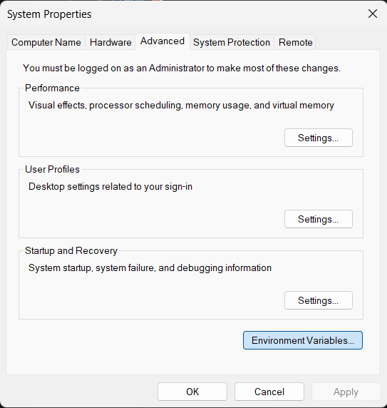
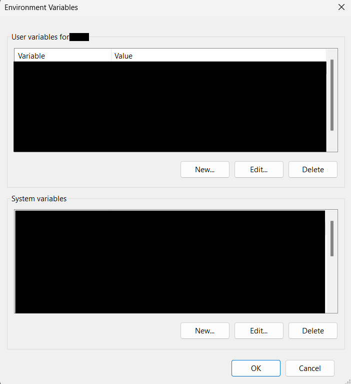
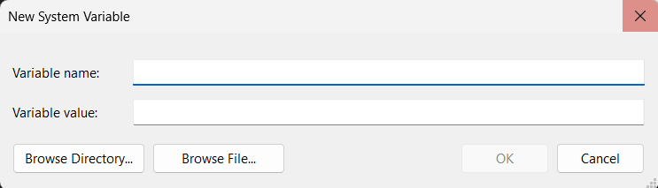
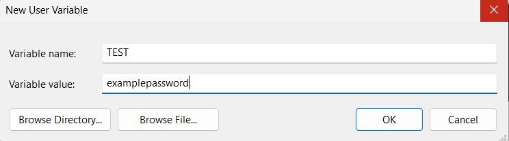

# **How to store/secure password in Environment Variables in Window**

### Use cases
Besides ***Password***, it could also be used to hide (or make private of) the ***API Key***, ***Username***, ***Private key***, etc. in case you want to publish the code while keeping those private stuff unseen.

## How to

### Password/API Key should not be explicitly on the code.
```Py
username = example@gmail.com
password = examplepassword
```
Storing password in the way below is dangerous for GitHub. The sample below is shown and written with Python v3.11.4

### Open the system properties

It is obviously safer to store the password in the Environment Variables. ***Press the windows*** button and search and type ***Edit the system environment variables*.**

**Typing *envi* in search would produce a faster result.**

### Open Environment Variables

Click the ***Environment Variables*** button.

### Create a new variable.

Create your password on User variables. ***Click the New... button*** on User variables section.

The password must be stored in the ***Variable value box***. The ***Variable name*** could be anything and it will be used as a placeholder (sub) for the password.

For example, the ***Variable name*** is ***TEST*** and the password (***Variable Value***) is ***examplepassword***, then click ok.
***Restart your computer before proceeding.***
### Call the Variable using `os library`
```Py
import os

username = example@gmail.com
password = os.getenv("TEST")
```
First, import os library, then replace the ***examplepassword*** with `os.getenv("TEST")`. Use `os.getenv()` and insert string of the ***Variable name*** inside the parenthesis.